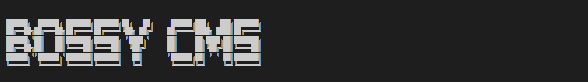
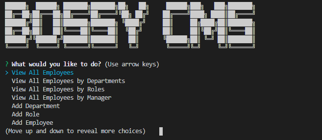
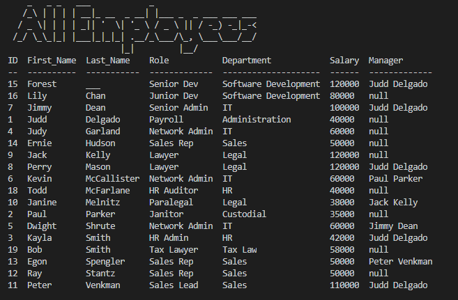
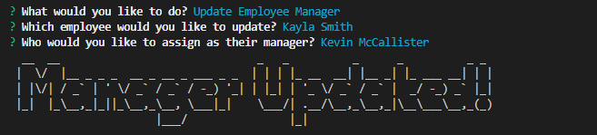
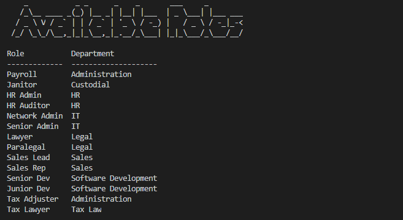

# Manage Your Team!

BossyCMS is a small Node CLI Content Management System that allows you easily view, edit, and update your employee base. 
Link to the BossyCMS GitHub: [Bertodemus](https://github.com/Bertodemus/BossyCMS)


## Table of Contents

* [Description](#description)
* [Installation](#installation)
* [Usage](#usage)
* [Screenshots](#screenshots)
* [Questions](#questions)


## Description

* Simple command-line application that can be run through [Node.js](https://nodejs.org/en/)
* Consists of an `index.js` file, a `package.json` file, a folder named "lib" (which contains three JS modules `add.js`, `update.js`, `view.js`), a folder named "staging" (which contains a base MySql file for building the database - `schema.sql` - and a file for populating the database with data - `seeds.sql`), and an "images" folder with a banner image and screenshots for the README.
* Utilizes  the [Inquirer package](https://www.npmjs.com/package/inquirer), the [MySQL package](https://www.npmjs.com/package/mysql), the [Figlet package](https://www.npmjs.com/package/figlet), and the [console.table package](https://www.npmjs.com/package/console.table)


## Installation

* You will need to intialize a MySQL database. More information on MySQL, go to : [MySQL](https://www.mysql.com/)
    * Once your MySQL envrionment is up and running, you can use the included `schema.sql` to create the "bossycms_db' database
    * You can use the provided `seed.sql` file to populate your database with some information
* The Node.js runtime environment will need to be installed, first.
    * For more information, go to : [Node.js](https://nodejs.org/en/)
* Copy the files `index.js`, `package.json`, and all of the folders to a local storage location.
* Through a terminal, navigate to the location of the stored files
    * Install the required dependencies by running the following command in the Node runtime environment:
        ```
        npm i
        ```
* Once the dependencies are installed, run the `index.js` file
    * To run the file, use the following command:
        ```
        node index
        ```

## Usage

When the application is initiated, the user will be met with a menu containing multiple selections. The user will be able to `View All Employees` sorted by `department`, `role`, or `manager`. The user will also be able to add `departments`, `roles`, and `employees`. When the user chooses to add entries, they will make their selections and then be returned to the main menu. The user can choose to `update` an employee's `role` or they can choose to `update` who manages that particular employee. At the bottom of the list, the user can do a simple view that shows the `available roles` and `available departments`. Lastly, there is an `exit` selection that closes the app.


## Screenshots

Views of the application in use










## Video

This link will allow to you download a small video file, which is a live demo of the application.

[BossyCMS Live Demo](https://github.com/Bertodemus/BossyCMS/blob/main/images/bossy.mp4?raw=true)


## Questions

Feel free to get in touch with me if you have any questions or concerns.

Link to my GitHub Profile: [Bertodemus](https://github.com/bertodemus)

Email me at: [roberto@robertorubet.com](roberto@robertorubet.com)

